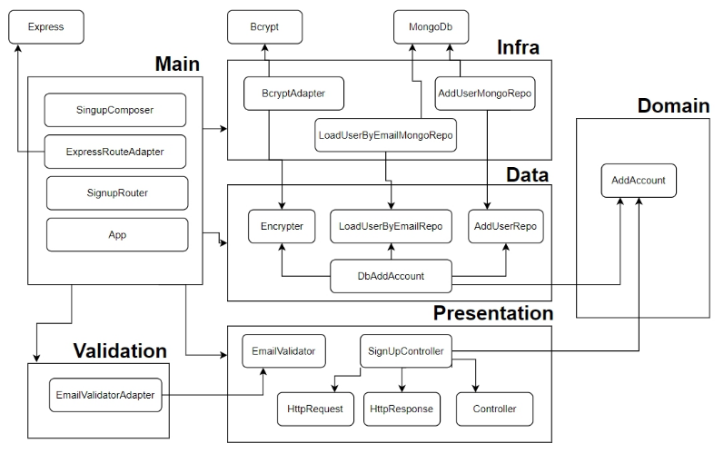

### O Projeto:

Projeto do livro: [Desenvolvimento de Backend com Node.js, TypeScript, MongoDB e Docker: Práticas Avançadas com TDD, DDD, Clean Architecture e SOLID
](https://www.amazon.com.br/gp/product/B0CGCCMY2Q/ref=kinw_myk_ro_title)

---

### :raising_hand: Sobre Min:

 [](https://www.linkedin.com/in/jos%C3%A9-r-99896a39/) [](https://twitter.com/aromademirtilo) [](https://www.instagram.com/learningenuity/) 

---

#### :keyboard: Snippet para criar testes em jest no VsCode:
No menu do `VsCode` acesse `Arquivo > Preferências > Configurar Snippets de Usuário` criar um snippt chamado `javascript.json` e inserir o seguinte código:
```javascript
{
  "JestTest": {
    "prefix": ["test"],
    "body": [
      "describe('Describe HERE', () => {",
      "	test('Test HERE', () => {",
      "		",
      "	})",
      "})",
    ],
    "description": "Bloco Jest"
  }
}
```

---

#### :bar_chart: Diagrama do projeto usando Clean Architecture:


_Imagem retirada do livro_


---

#### :wolf: Configurando Husky:
```bash
$ mkdir .husky
$ npx husky add .husky/commit-msg ".git/hooks/commit-msg \$1"
$ ln -s ../.husky/commit-msg .git/hooks/commit-msg
```
`.huskyrc.json`:
```json
{
    "hooks": {
        "pre-commit": "lint-staged",
        "pre-push": "1"
    }
}
```