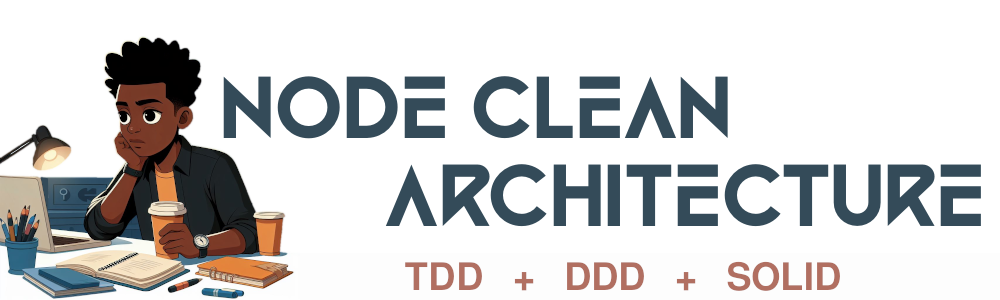

<a id="clean-node-api"></a>




[](https://nodejs.org/en) [](https://expressjs.com/) [](https://www.npmjs.com/) [](https://eslint.org/) [](https://jestjs.io/) [](https://www.docker.com/) [](https://github.com/) [](https://code.visualstudio.com/) <!-- icons by https://simpleicons.org/?q=types -->

 

---

<a id="encontreme"></a>
### 🕸️ Redes:

[](https://www.linkedin.com/in/jos%C3%A9-r-99896a39/) [](https://dev.to/learningenuity) [](mailto:learningenuity@gmail.com) [](https://twitter.com/aromademirtilo) [](https://www.instagram.com/learningenuity) 

---

<a id="indice"></a>
## :arrow_heading_up: index

[Node Clean Architecture](#clean-node-api)<br/>
  1. :arrow_heading_up: [index](#arrow_heading_up-index)
  2. :green_book: [Sobre](#sobre)
  3. :white_check_mark: [Testes](#test)
  4. :bar_chart: [Diagrama](#diagrama)
  5. :wolf: [Configurando Husky](#husky)
  6. :robot: [Uso de IA](#ia)
  

---
<a id="sobre"></a>
### :green_book: Sobre:

Projeto do livro: [Desenvolvimento de Backend com Node.js, TypeScript, MongoDB e Docker: Práticas Avançadas com TDD, DDD, Clean Architecture e SOLID
](https://www.amazon.com.br/gp/product/B0CGCCMY2Q/ref=kinw_myk_ro_title)

[:arrow_heading_up: voltar](#indice)

---

<a id="test"></a>

#### :white_check_mark: Snippet para criar testes em jest no VsCode:
No menu do `VsCode` acesse `Arquivo > Preferências > Configurar Snippets de Usuário` criar um snippt chamado `javascript.json` e inserir o seguinte código:
```javascript
{
  "JestTest": {
    "prefix": ["test"],
    "body": [
      "describe('Describe HERE', () => {",
      "	test('Test HERE', () => {",
      "		",
      "	})",
      "})",
    ],
    "description": "Bloco Jest"
  }
}
```

[:arrow_heading_up: voltar](#indice)

---
<a id="diagrama"></a>
#### :bar_chart: Diagrama do projeto usando Clean Architecture:


_Imagem retirada do livro_

[:arrow_heading_up: voltar](#indice)

---
<a id="husky"></a>

#### :wolf: Configurando Husky:
```bash
$ mkdir .husky
$ npx husky add .husky/commit-msg ".git/hooks/commit-msg \$1"
$ ln -s ../.husky/commit-msg .git/hooks/commit-msg
```
`.huskyrc.json`:
```json
{
    "hooks": {
        "pre-commit": "lint-staged",
        "pre-push": "1"
    }
}
```

[:arrow_heading_up: voltar](#indice)

---

<a id="ia"></a>
### :robot: Uso de IA:

O cabeçalho desta página foi criado com a fonte [cinema-st](https://www.dafont.com/pt/cinema-st.font?text=CineTicket&psize=l) e o auxílio de inteligência artificial e um mínimo de 
retoque e construção no Gimp [](https://www.gimp.org/)


__Foram utilizados os seguintes prompts para sua criação no [Bing IA:](https://www.bing.com/images/create/)__


<details>
  <summary><b>Estudante</b></summary>
<i>"estudante negro de cabelo black power atento bebendo cafe em estilo cartoon cores chapadas fundo com poucos detalhes em frente ao notebook a noite com canetas e papeis sobre a mesa e um quadro ao fundo com diagramas em formato hexagonal e fluxogramas, cores chapadas fundo branco para facil remocao do fundo, logo para projeto no github"<b>(sic)</b></i>
</details>

<br/>


IA também é utilizada em minhas pesquisas e estudos como ferramenta de apoio; no entanto, __artes e desenvolvimento são, sobretudo, atividades criativas humanas.__

Contrate artistas para projetos comerciais ou mais elaborados e Aprenda Engenhosidade!

[:arrow_heading_up: voltar](#indice)